# Project Overview

# 1. Introduction: Summarize your project report in several paragraphs.

## 1. What is the problem?

The primary goal is to enhance the understanding of human biology at the cellular level by mapping the human vasculature. This involves analyzing complex tissue images to identify and segment vascular structures accurately.
The motivation behind this problem is to contribute to a more comprehensive human body map, aiding in medical research, disease diagnosis, and potential treatments.

## 2. Why is this problem interesting?

This problem is intriguing because it sits at the intersection of advanced image processing, machine learning, and critical biological research.
Solving this problem could advance our understanding of various diseases, particularly those related to vascular health, and could eventually lead to breakthroughs in medical diagnostics and treatment strategies.

## 3. What is the approach you propose to tackle the problem?

The proposed approach involves semantic segmentation, a process of classifying each pixel in an image into a specific category (here, vascular or non-vascular).
Semantic segmentation is chosen because of its effectiveness in detailed and granular image analysis, which is crucial for accurately mapping the intricate vasculature in human tissues.

## 4. What is the rationale behind the proposed approach?

Semantic segmentation models like DeepLab(v3) is known for their accuracy in image segmentation tasks. These models can learn complex patterns in data, making them suitable for biomedical image analysis.
This approach might be inspired by previous successful applications of semantic segmentation in medical imaging. It differs in its specific application to vasculature mapping and possibly in the fine-tuning of the model parameters and training process tailored to this unique dataset.

## 5. What are the key components of my approach and results? Also, include any specific limitations.

The key components include the use of advanced convolutional neural networks for segmentation tasks, data preprocessing techniques for biomedical images, and possibly post-processing steps to refine the segmentation results.
Limitations might include the potential for overfitting due to the highly specialized nature of the data, challenges in generalizing the model to different types of tissue images, and computational resource requirements.

# 2. Setup: Set up the stage for your experimental results.

## 1. Describe the dataset, including its basic statistics

The competition data comprises tiles extracted from five Whole Slide Images (WSI) split into two datasets. Tiles from Dataset 1 have annotations that have been expert reviewed. Dataset 2 comprises the remaining tiles from these same WSIs and contain sparse annotations that have not been expert reviewed.

All of the test set tiles are from Dataset 1.
Two of the WSIs make up the training set, two WSIs make up the public test set, and one WSI makes up the private test set.
The training data includes Dataset 2 tiles from the public test WSI, but not from the private test WSI.

**Files and Field Descriptions**

- **{train|test}/** Folders containing TIFF images of the tiles. Each tile is 512x512 in size.

- **polygons.jsonl** Polygonal segmentation masks in JSONL format, available for Dataset 1 and Dataset 2. Each line gives JSON annotations for a single image with:

  - **id** Identifies the corresponding image in train/
  - **annotations** A list of mask annotations
  - **type** Identifies the type of structure annotated:
    - **blood_vessel** The target structure. Your goal in this competition is to predict these kinds of masks on the test set.
    - **glomerulus** A capillary ball structure in the kidney. These parts of the images were excluded from blood vessel annotation. You should ensure none of your test set predictions occur within glomerulus structures as they will be counted as false positives. Annotations are provided for test set tiles in the hidden version of the dataset.
    - **unsure** A structure the expert annotators cannot confidently distinguish as a blood vessel.
  - **coordinates** A list of polygon coordinates defining the segmentation mask.

- **tile_meta.csv** Metadata for each image. The hidden version of this file also contains metadata for the test set tiles.
  - **source_wsi** Identifies the WSI this tile was extracted from.
  - **{i|j}** The location of the upper-left corner within the WSI where the tile was extracted.
  - **dataset** The dataset this tile belongs to, as described above.
- **wsi_meta.csv** Metadata for the Whole Slide Images the tiles were extracted from.
  - **source_wsi** Identifies the WSI.
  - **age, sex, race, height, weight, and bmi demographic information** about the tissue donor.
- **sample_submission.csv** A sample submission file in the correct format. See the Evaluation page for more details.

**Data Preview**

**Dataset 1**

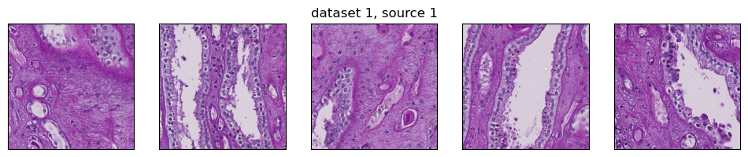
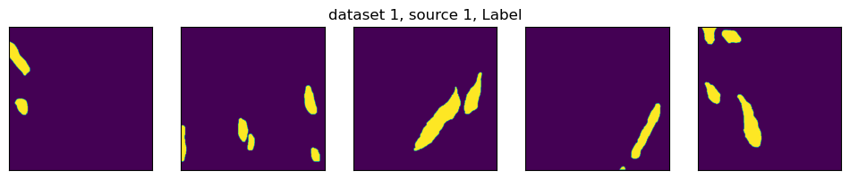
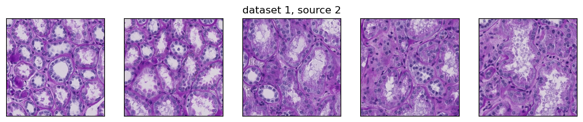
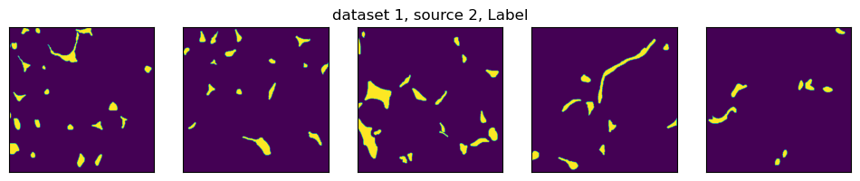

**Dataset 2**

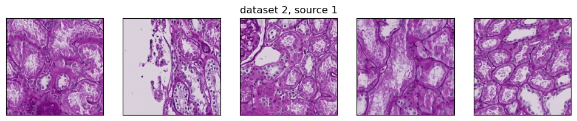
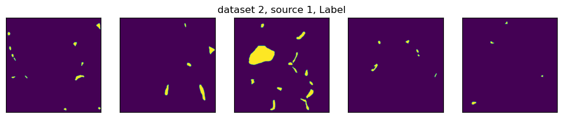
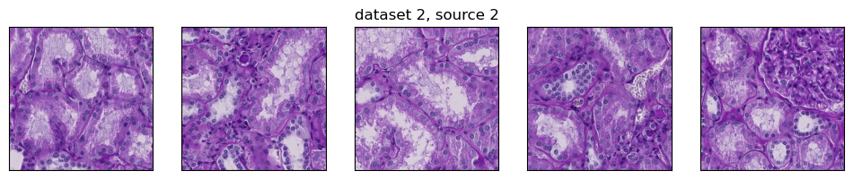
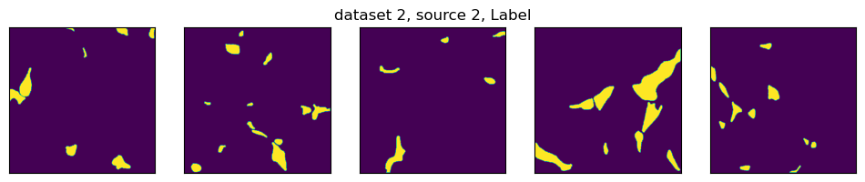
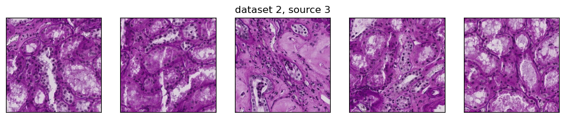
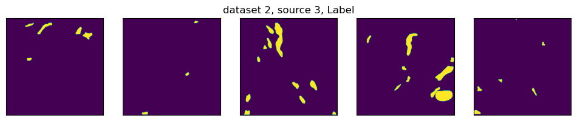
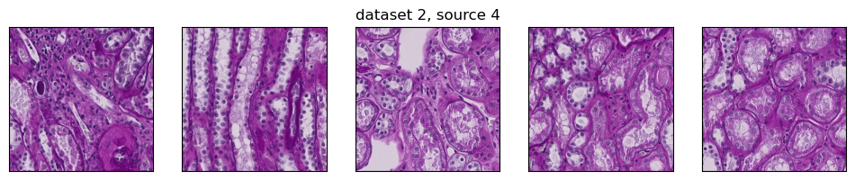
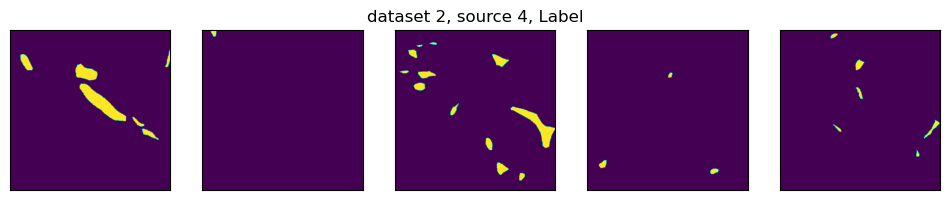

**Size and quantity of Blood Vessels**

Dataset 1 source 1 has a different distribution from others. It has fewer blood vessels, but their size is larger. Please note that one dot corresponds to one image in scatterplots.

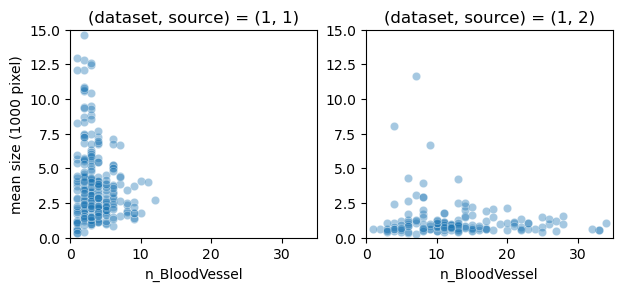
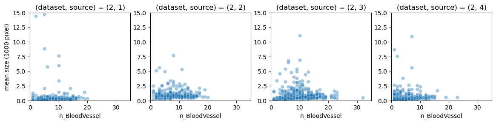
**Reference** ：https://www.kaggle.com/competitions/hubmap-hacking-the-human-vasculature/data
https://www.kaggle.com/code/hidetaketakahashi/hubmap-segmentation-report
https://www.kaggle.com/code/huangzeyuzheng/eda-for-hubmap-2023

**Training Data**: The dataset includes 7033 samples, each with a resolution of 512 x 512 x 3 pixels and a data type of uint8​​.

**Test Data**: There is one test sample with the same resolution and data type as the training data, with a mean intensity of 163.5 and a standard deviation of 53.1​​.

**CSV Data**: The dataset is accompanied by CSV files, including tile_meta.csv, which contains tile information with various columns like ID, source WSI (Whole Slide Images), and dataset category. The tiles are categorized into three groups: expert-reviewed annotations, sparse annotations not expert-reviewed, and tiles without annotations from additional WSIs​​.

**Annotations**: The annotations are provided in polygons.jsonl, with 1633 unique IDs. The labels include blood vessel, glomerulus, and unsure, corresponding to the segmentations masks named mask.tif​​.

## 2.Describe the experimental setup, including what models you are going to run, what parameters you plan to use, and what computing environment you will execute on.

    Models: The experiment will involve running models like DeepLab(v3) within the PyTorch framework, integrated with MMSegmentation for semantic segmentation tasks.
    Parameters: For this model, specific parameters such as learning rate, number of layers, filter sizes, and regularization techniques will be tuned based on initial experiments and validation performance.
    Loss function: combined cross entropy loss and focal loss
    Optimizational Algorithm: SGD
    Leaning rate: 0.005
    batch size: 2
    iteration: 31000
    Computing Environment: The experiments is conducted on a high-performance computing environment, likely equipped with GPUs to facilitate efficient training and evaluation of deep learning models.
    Python 3.3
    Pytorch 1.13
    CUDA 11.7

3.                   Describe the problem setup (e.g., for neural networks, describe the network structure that you are going to use in the experiments).

This model will use atrous convolutions to capture multi-scale information and include an atrous spatial pyramid pooling module to robustly segment objects at multiple scales.

The figure below shows the basic architecture of a DeepLabv3 network, where the main blocks are just the backbone and the head. Each of the main blocks is comprised of sub-blocks.

3.                   Results: Describe the results from your experiments.
1.                   Main results: Describe the main experimental results you have; this is where you highlight the most interesting findings.
    Performance
    Loss

Minimum Loss: 0.035
Minimum Loss Iter: 26050

Accuracy
To evaluate the accuracy of the performance, we used 3 types of scores: aAcc, mDice, and mAcc.

"aAcc," "Dice," and "mAcc" are metrics commonly used in fields like medical imaging, computer vision, and particularly in tasks like image segmentation.

aAcc(Average Accuracy) represents the average accuracy across all classes in a classification task. In the context of image segmentation, this would mean calculating the accuracy for each class (i.e., how well the model can identify each specific class in the image) and then averaging these accuracies.

Dice Coefficient (Dice Similarity Coefficient, DSC) is a statistical tool used to gauge the similarity of two samples. In image segmentation, it's often used to measure the similarity between the ground truth segmentation and the segmentation predicted by the model. The formula for the Dice Coefficient is

A Dice Coefficient of 1 indicates perfect agreement between the predicted segmentation and the ground truth, while a coefficient of 0 indicates no overlap.

mAcc (Mean Accuracy) is another metric used to evaluate the performance of a classification model. It's calculated as the average of the class-wise accuracy. In image segmentation, this means computing the accuracy for each segment or class separately and then taking the average of these accuracies. It differs from Average Accuracy in the way it normalizes or weights the accuracy of each class before averaging.

Scores for each class

Class
Dice
Acc
background
97.91
97.41
blood_vessel
63.36
70.32
glomerulus
96.22
96.03

Total Accuracy:
aAcc: 96.1800 mDice: 85.8300 mAcc: 87.9200

Comparison with other models
We compared our result with others' results on the same dataset. https://www.kaggle.com/code/hidetaketakahashi/hubmap-segmentation-report#7.-Analysis-of-Validation-Result

They used IoU to evaluate their models. They performed UNET and FCN on the dataset and used IoU to evaluate their models. So we calculated the IoU of our DeepLab model for comparison.

Intersection over Union (IoU) is a fundamental metric used in the field of computer vision, particularly in object detection and image segmentation tasks. It quantifies the overlap between two areas, typically between the ground truth and the predicted output of a model. The IoU is calculated by dividing the area of overlap between the predicted and true regions by the area of union of these regions. Essentially, it measures how much the predicted boundary overlaps with the ground truth boundary, with a value of 1 indicating perfect overlap and a value of 0 indicating no overlap at all. This metric is crucial for evaluating the accuracy of models in tasks where precise localization of objects within an image is important.

The comparison is as follows:

Model
FCN
UNET
DeepLab
IoU
0.36
0.37
0.43

Segmentation Results

2.                   Supplementary results:
    Parameter choices
    Cross Entropy: class weight: 0.5, 2, 1
    Focal loss: alpha: 0.25, 1, 0.75
    Cross Entropy: loss weight: 0.4
    Focal loss: loss weight: 1
    Learning rate: 0.005
    Optimizer: SGD
    batch size: 2
    iteration: 31000

Class
Dice
Acc
background
97.91
97.41
blood_vessel
63.36
70.32
glomerulus
96.22
96.03

Comparative Experiments
Another parameter set we has tried:
Cross Entropy: class weight: 0.1, 2, 1
Focal loss: alpha: 0.25, 0.75, 0.75
Cross Entropy: loss weight: 0.4
Focal loss: loss weight: 1

Class
Dice
Acc
background
0
0
blood_vessel
9.6
99.3
glomerulus
41.52
95.58

4.                   Discussion:
    Strengths
    The model shows high accuracy and Dice scores for 'background' and 'glomerulus' classes, indicating its effectiveness in these areas.
    The performance on the 'blood_vessel' class, though satisfactory, is lower than the other classes. This is because of the nature of the dataset. Blood vessels in different parts of the kidney are not the same. In this dataset, there are tissues samples from the renal cortex, renal medulla and renal papilla. Moreover, The microvasculature structures are different in those three types of tissue.

Comparison with FCN and UNET
The model's Intersection over Union (IoU) score was compared with other models (FCN and UNET) on the same dataset. Your DeepLab model achieved the highest IoU of 0.43, surpassing FCN (0.36) and UNET (0.37). This suggests superior boundary overlap accuracy. There could be the following reasons:

The DeepLab model's superior performance in IoU and other key metrics over FCN and UNET can be attributed to several strategic enhancements. Firstly, the DeepLab model inherently possesses architectural advantages that are conducive to more accurate semantic segmentation. This architecture is designed to efficiently capture multi-scale contextual information, which is crucial in delineating precise object boundaries in complex images.
Additionally, the data preprocessing phase in this research was significantly augmented through extensive data augmentation techniques. By incorporating random scaling, random cropping, random flipping, and photometric distortion, the model was exposed to a more diverse set of training examples. This variety in the training dataset likely contributed to the model's enhanced ability to generalize and accurately segment images under various conditions and orientations, thereby improving its IoU score.
Another pivotal aspect of the model's success is the innovative combination of cross entropy loss and focal loss used as the model's loss function. Cross entropy loss is a standard choice for classification tasks, effectively handling the basic segmentation challenges. However, the integration of focal loss is particularly beneficial in addressing the issue of class imbalance, a common challenge in semantic segmentation tasks. Focal loss places more emphasis on hard-to-classify examples, ensuring that the model does not become biased towards the dominant classes and pays adequate attention to all classes, including those that are underrepresented or more challenging to segment. This balanced approach towards learning is likely a key factor in achieving higher IoU scores, as it ensures more accurate predictions across all classes.

    Areas for Improvement
    Despite the notable success of the DeepLab model in surpassing the IoU metrics of FCN and UNET, there remains room for further enhancement to achieve even greater accuracy and efficiency in semantic segmentation. Key areas for potential improvement include:

Class-Specific Optimization: While the overall performance is commendable, certain classes may still exhibit lower accuracy or Dice scores. Targeted improvements, such as class-specific training strategies or advanced data augmentation techniques tailored for these challenging classes, could enhance the model's precision across all categories.
Computational Efficiency: Although the model achieves high accuracy, the complexity of the DeepLab architecture might impact the computational efficiency, particularly for large-scale or real-time applications. Exploring methods to streamline the model, such as pruning, quantization, or employing more efficient backbone networks, could reduce computational demands while maintaining high accuracy.
Robustness to Varied Inputs: To further improve the model's robustness and adaptability, testing and training on a more diverse set of images, especially those with varying qualities and from different domains, could be beneficial. This could help in assessing and enhancing the model's generalization capabilities.
Loss Function Refinement: While the combination of cross entropy loss and focal loss has shown promising results, continual experimentation with other loss functions or a more refined weighting strategy between these losses could yield even better segmentation outcomes.
Deep Learning Innovations: Staying abreast of the latest advancements in deep learning and integrating novel neural network architectures, regularization techniques, or training methodologies could provide additional performance boosts.

5.                   Conclusion: In several sentences, summarize what you have done in this project.

In this project, I employed the DeepLab model for semantic segmentation of microvessels and glomeruli in images. During data pre-processing, I applied extensive data augmentation techniques, including random scaling, random cropping, random flipping, and photometric distortion, along with data normalization. Throughout the training process, I utilized a custom loss function combining cross-entropy loss and focal loss, and employed Stochastic Gradient Descent (SGD) as the optimization algorithm. This approach resulted in the model achieving high accuracy and precision in segmenting the targeted structures, outperforming other models in key metrics such as IoU. This success highlights the effectiveness of the chosen methodologies in handling the complexities of microvascular and glomerular image segmentation.

6.                   References: Put any links, papers, blog posts, or GitHub repositories that you have borrowed from/found useful here.
    https://www.kaggle.com/competitions/hubmap-hacking-the-human-vasculature
    https://www.kaggle.com/code/hidetaketakahashi/hubmap-segmentation-report
    https://www.kaggle.com/code/huangzeyuzheng/eda-for-hubmap-2023
    https://github.com/open-mmlab/mmsegmentation

https://www.kaggle.com/code/hidetaketakahashi/hubmap-segmentation-report#7.-Analysis-of-Validation-Result
https://medium.com/@itberrios6/deeplabv3-c0c8c93d25a4
https://arxiv.org/abs/1706.05587v3
